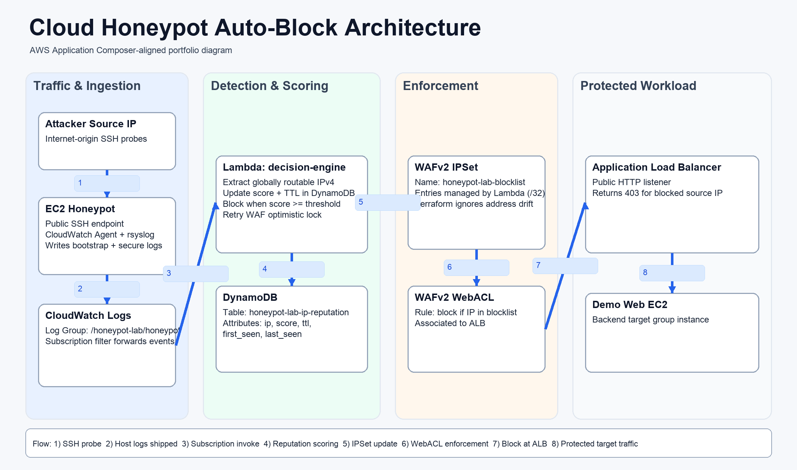

# Cloud Honeypot Auto-Block (AWS + Terraform)

Portfolio project that implements an automated detect-and-respond pipeline in AWS: public honeypot telemetry is scored in near real-time and abusive IPs are blocked through WAF without manual intervention.



## Project Snapshot

- **Goal:** Build a practical SOC-style cloud security workflow, not just a static architecture.
- **Detection path:** SSH probe -> CloudWatch Logs -> Lambda decision engine -> DynamoDB reputation.
- **Response path:** Score threshold reached -> WAF IP set update -> blocked at ALB.
- **Outcome:** End-to-end infrastructure and validation runbook for repeatable demos in a clean AWS account.

## What This Project Demonstrates

- Infrastructure as code with Terraform for a multi-service AWS security pipeline.
- CloudWatch Logs subscription into Lambda for event-driven detections.
- DynamoDB-backed reputation scoring with TTL.
- Automated WAF IP set enforcement once a threshold is reached.
- Practical SOC-style observability with structured Lambda decision logs.

## Core AWS Services

- EC2 (honeypot + demo backend)
- CloudWatch Logs + subscription filters
- Lambda (decision engine)
- DynamoDB (IP reputation scoring + TTL)
- WAFv2 (IPSet + WebACL)
- ALB (protected demo endpoint)

## Architecture Flow

1. Public SSH attempts hit a honeypot EC2 instance.
2. CloudWatch Agent ships honeypot logs to `/honeypot-lab/honeypot`.
3. CloudWatch Logs subscription triggers the `decision-engine` Lambda.
4. Lambda extracts source IPv4, updates score in DynamoDB.
5. When score >= threshold, Lambda writes attacker `/32` into WAF IP set.
6. WAF WebACL blocks that IP at the ALB layer.

## Detection and Blocking Rules

- Extract only valid, globally-routable IPv4 addresses from log lines.
- Ignore allowlisted addresses (`ALLOWLIST_IPS`).
- Increment per-IP score atomically in DynamoDB.
- Add `/32` to WAF IP set when score meets/exceeds `block_threshold`.
- Retry WAF optimistic lock conflicts with backoff under concurrent updates.

## Repository Structure

```text
.
├── README.md
├── docs
│   ├── architecture
│   │   ├── application-composer-diagram.png
│   │   ├── application-composer-template.yaml
│   │   ├── application-composer.md
│   │   └── overview.md
│   └── runbooks
│       ├── deploy.md
│       └── validate.md
├── infra
│   └── terraform
│       ├── src/decision_engine/index.py
│       ├── *.tf
│       └── terraform.tfvars.example
└── .github
    └── workflows
        └── terraform-ci.yml
```

## Quick Start

1. Configure AWS credentials for your target account/region.
2. Copy vars file:

```bash
cd infra/terraform
cp terraform.tfvars.example terraform.tfvars
```

3. Update `terraform.tfvars` for your account/region.
4. Deploy:

```bash
terraform init
terraform plan -out tfplan
terraform apply tfplan
```

5. Capture outputs:

```bash
terraform output
```

## Validate the End-to-End Pipeline

Use: `docs/runbooks/validate.md`

Core checks:

- Honeypot log streams are present (`bootstrap` + `secure`).
- Lambda emits `SOC_PIPELINE_START`, `IP_OBSERVED`, `IP_DECISION`.
- DynamoDB score increases for attacker IP.
- WAF IP set receives attacker `/32`.
- ALB returns `403` for blocked source IP.

## Documentation

- Architecture overview: `docs/architecture/overview.md`
- Deployment runbook: `docs/runbooks/deploy.md`
- Validation/test runbook: `docs/runbooks/validate.md`
- AWS Application Composer template: `docs/architecture/application-composer-template.yaml`

## AWS Application Composer Diagram

Use `docs/architecture/application-composer-template.yaml` in AWS Application Composer:

- Import the template.
- Auto-arrange/group resources.
- Export a PNG/SVG for your portfolio README.
- Included portfolio diagram asset: `docs/architecture/application-composer-diagram.png`

Detailed steps: `docs/architecture/application-composer.md`.

## Security Notes

- Never commit Terraform state or credential files.
- This repo includes `.gitignore` rules for state/plan/artifact safety.
- Use a remote backend with encryption + locking before production use.

## Cleanup

```bash
cd infra/terraform
terraform destroy
```
