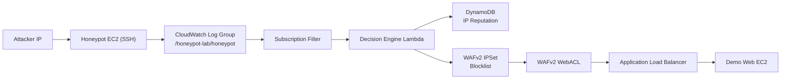

# Architecture Overview

## Diagram (Quick View)

## Core Components

- `aws_instance.honeypot`: Public SSH honeypot endpoint.
- `aws_cloudwatch_log_group.honeypot`: Central log intake from honeypot host.
- `aws_cloudwatch_log_subscription_filter.honeypot_to_lambda`: Event stream to decision engine.
- `aws_lambda_function.decision_engine`: Parses source IPs, scores activity, decides block actions.
- `aws_dynamodb_table.ip_reputation`: IP reputation store (`score`, `first_seen`, `last_seen`, `ttl`).
- `aws_wafv2_ip_set.blocklist`: Dynamic block entries (`/32`) managed by Lambda.
- `aws_wafv2_web_acl.honeypot_acl`: Enforces blocklist at edge for ALB-protected app.
- `aws_lb.demo_alb`: WAF-protected demo endpoint.

## Detection and Enforcement Sequence

1. Attacker attempts SSH against the honeypot.
2. Host logs are shipped to CloudWatch.
3. Subscription invokes Lambda with batched log events.
4. Lambda extracts globally-routable IPv4 addresses.
5. Lambda updates score in DynamoDB (atomic increment + TTL refresh).
6. If score is below threshold: emit `IP_OBSERVED` only.
7. If score meets threshold: add IP `/32` to WAF IP set.
8. WAF WebACL blocks traffic from the source IP to protected ALB.

## Operational Guardrails

- Allowlist support (`ALLOWLIST_IPS`) prevents blocking trusted addresses.
- Auto-block feature flag (`AUTO_BLOCK_ENABLED`) supports observe-only mode.
- WAF optimistic lock retry/backoff is implemented to handle concurrent updates.
- IP set size cap (`MAX_IPSET_SIZE`) avoids unbounded growth.

## Portfolio Talking Points

- End-to-end cloud security automation, not isolated scripts.
- Concrete detection-to-response loop within managed AWS services.
- Real infra lifecycle management with Terraform and repeatable deployment.
